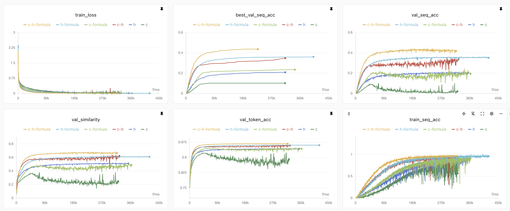

<div align="center">

# 🤓 NMRTrans: Structure Elucidation from Experimental NMR Spectra via Set Transformers

[](https://arxiv.org/abs/2602.10158)
[](https://huggingface.co/collections/little1d/nmrtrans)
[](https://swanlab.cn/@Harrison/NMRTrans/overview)

</div>

NMRTrans is a transformer-based framework that performs structure elucidation from experimental NMR spectra. By leveraging Set Transformers with Induced Set Attention Blocks (ISAB) and Pooling by Multihead Attention (PMA), NMRTrans encodes unordered NMR peak sets into modality-specific representations. The framework fuses these representations with optional molecular formula constraints and employs a T5 decoder for autoregressive SMILES generation, effectively handling the permutation-invariant nature of spectral data while maintaining chemical validity.

<div align="center">
  
</div>

## 📢 Latest News
- **2026.7.2**: Pretrained checkpoints released and the codebase has been refactored.
- **2026.5.17**: NMRTrans was accepted to the KDD 2026 AI4S Track!
- **2026.3.6**： 🚀 Release training, inference code & datasets.
- **2026.2.10**： 📄 Our paper is now available on [arXiv](https://arxiv.org/pdf/2602.10158).

## 💻 Installation

Clone the repository:

```bash
git clone https://github.com/little1d/NMRTrans.git
cd NMRTrans
```

Create a Python 3.10 environment and install dependencies with `uv`:

```bash
conda create -n nmrtrans python=3.10 -y
conda activate nmrtrans

pip install uv
uv pip install -e .
```

## ⚙️ Configuration

NMRTrans uses a single YAML entry point for both training and inference:

```bash
cp configs/config.yaml configs/local.yaml
# Edit configs/local.yaml for local paths, checkpoints, data paths, and runtime settings.
```

Paths in YAML files are resolved relative to the project root. At least one NMR modality must be enabled with `USE_C_NMR` or `USE_H_NMR`; molecular formula guidance is optional through `USE_FORMULA_GUIDANCE`.

`src/config_local.py` is still supported for compatibility only when no YAML file is passed. When `--config_path` is provided, configuration is resolved from project defaults plus that YAML file, without inheriting values from `config_local.py`. To use local Python overrides instead of YAML, copy the template and run `python src/train.py` without `--config_path`:

```bash
cp src/config_local.py.example src/config_local.py
```

## 🔬 Inference

Pretrained checkpoints are available from the [NMRTrans Hugging Face collection](https://huggingface.co/collections/little1d/nmrtrans). Download the checkpoint that matches the input features you want to use.

For the C-NMR + H-NMR + Formula baseline:

```bash
mkdir -p checkpoints/pretrained
huggingface-cli download little1d/C-H-Formula nmrtrans-c-h-nmr-formula.ckpt --local-dir checkpoints/pretrained

python src/test.py \
  --config_path configs/local.yaml \
  --ckpt_path checkpoints/pretrained/nmrtrans-c-h-nmr-formula.ckpt \
  --features c_nmr,h_nmr,formula
```

Other released checkpoints can be downloaded in the same way by substituting the Hugging Face repository and checkpoint filename:

| Input features | Hugging Face repo | Checkpoint file | `--features` |
| --- | --- | --- | --- |
| C-NMR | `little1d/C` | `nmrtrans-c-nmr.ckpt` | `c_nmr` |
| H-NMR | `little1d/H` | `nmrtrans-h-nmr.ckpt` | `h_nmr` |
| C-NMR + H-NMR | `little1d/C-H` | `nmrtrans-c-h-nmr.ckpt` | `c_nmr,h_nmr` |
| C-NMR + Formula | `little1d/C-Formula` | `nmrtrans-c-nmr-formula.ckpt` | `c_nmr,formula` |
| H-NMR + Formula | `little1d/H-Formula` | `nmrtrans-h-nmr-formula.ckpt` | `h_nmr,formula` |
| C-NMR + H-NMR + Formula | `little1d/C-H-Formula` | `nmrtrans-c-h-nmr-formula.ckpt` | `c_nmr,h_nmr,formula` |

Template:

```bash
huggingface-cli download <repo_id> <checkpoint_file> --local-dir checkpoints/pretrained

python src/test.py \
  --config_path configs/local.yaml \
  --ckpt_path checkpoints/pretrained/<checkpoint_file> \
  --features <feature_list>
```

Make sure `configs/local.yaml` points to the corresponding data/cache paths before running evaluation on the released test split.

## 📊 Results

The table reports greedy top-1 autoregressive decoding on the released test split. Epochs refer to the selected validation-best checkpoints used for release.

| Input features | Epoch | Sequence acc. | Token acc. | Tanimoto similarity |
| --- | ---: | ---: | ---: | ---: |
| C-NMR | 8529 | 0.0427 | 0.3816 | 0.3296 |
| H-NMR | 7469 | 0.1994 | 0.5647 | 0.5516 |
| C-NMR + H-NMR | 7469 | 0.3646 | 0.6824 | 0.6997 |
| C-NMR + Formula | 8189 | 0.1813 | 0.5062 | 0.5153 |
| H-NMR + Formula | 9589 | 0.3719 | 0.6673 | 0.6902 |
| C-NMR + H-NMR + Formula | 5409 | 0.4447 | 0.7229 | 0.7569 |

> **Notes**
> - All metrics are computed under greedy top-1 autoregressive decoding.
> - These numbers may differ slightly from those reported in the paper because they were re-evaluated with the refactored codebase and released checkpoints.

## 🏋️ Training

Training from scratch requires the T5 backbone and the preprocessed NMRTrans data cache.

Download the T5 backbone:

```bash
mkdir -p models
huggingface-cli download t5-small --local-dir models/t5-small
```

Download the released training, validation, and test splits from the [NMRTrans-Data dataset repository](https://huggingface.co/datasets/little1d/NMRTrans-Data):

```bash
mkdir -p cache
huggingface-cli download little1d/NMRTrans-Data --repo-type dataset --local-dir cache
```

The released cache contains the pre-split train, validation, and test files used by the paper and the released checkpoints. Place them under `NMRTrans/cache` as shown above, then make sure the dataset paths in `configs/local.yaml` point to these files.

Train with the local YAML configuration:

```bash
export CUDA_VISIBLE_DEVICES=0,1,2,3

mkdir -p checkpoints

python src/train.py --config_path configs/local.yaml
```

The default example configuration is designed for 4 GPUs with `BATCH_SIZE=1024`. You can reduce the GPU count and batch size to run on smaller hardware, for example a single GPU with `BATCH_SIZE=128`. When changing the effective batch size, consider tuning related optimization parameters such as `Learning rate` and `ACCUM_GRAD_BATCHES`. These changes may affect convergence speed and final performance.

To train a different input combination, edit `USE_C_NMR`, `USE_H_NMR`, and `USE_FORMULA_GUIDANCE` in `configs/local.yaml`, or use one of the prepared experiment YAML files under `configs/`:

```bash
python src/train.py --config_path configs/experiment_c_h_formula.yaml
```

Resume training from a Lightning checkpoint:

```bash
python src/train.py \
  --config_path configs/local.yaml \
  --ckpt_path checkpoints/path/to/checkpoint.ckpt
```

We have open sourced the full training curves and experiment parameters on
[SwanLab](https://swanlab.cn/@Harrison/NMRTrans/overview) for reproducibility.

<div align="center">
  
</div>

## 🔧 Finetuning

NMRTrans checkpoints can be used as initialization for further training, but finetuning on new data is not always a plug-and-play data replacement. For in-distribution 1D NMR datasets with the same preprocessed format, users can usually start from an existing checkpoint and update the dataset paths in the YAML config.

For new spectral settings or additional modalities, such as 2D NMR or HSQC, the data pipeline and model interface should be adapted consistently. In practice, this may require updating the raw-data parser, the serialized dataset format, `MergedDataset`, the collate function, feature normalization, modality masks, and the corresponding encoder/fusion inputs in the model. After these changes, a pretrained NMRTrans checkpoint can still provide a useful initialization for compatible parts of the architecture, while newly introduced modules may need to be initialized and trained from scratch.

To continue training from a compatible checkpoint:

```bash
python src/train.py \
  --config_path configs/local.yaml \
  --ckpt_path checkpoints/path/to/checkpoint.ckpt
```

## 📝 Citation

If you use NMRTrans in your research, please cite:

```bibtex
@article{yang2026nmrtrans,
      title={NMRTrans: Structure Elucidation from Experimental NMR Spectra via Set Transformers},
      author={Liujia Yang* and Zhuo Yang* and Jiaqing Xie* and Yubin Wang* and Ben Gao and Tianfan Fu and Xingjian Wei and Jiaxing Sun and Jiang Wu and Conghui He and Yuqiang Li and Qinying Gu},
      year={2026},
      eprint={2602.10158},
      archivePrefix={arXiv},
      primaryClass={physics.chem-ph},
      url={https://arxiv.org/abs/2602.10158},
}
```

## 📬 Contact

Thank you for your interest in NMRTrans. If you have questions about the algorithm, implementation details, or issues encountered while running the code, please open a GitHub issue so the discussion can help other users as well. You can also reach us by email at yzachary1551@gmail.com.

## 📄 License

This project is released under the MIT License. See [LICENSE](LICENSE) for details.
