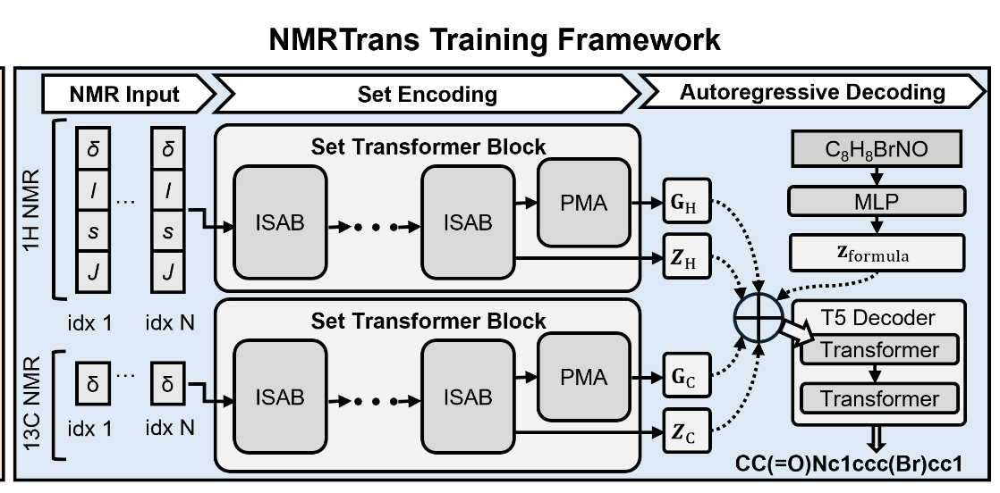

<div align="center">

# NMRTrans: Structure Elucidation from Experimental NMR Spectra via Set Transformers

[](https://arxiv.org/abs/2602.10158)
[](https://swanlab.cn/)

</div>

NMRTrans is a transformer-based framework that performs structure elucidation from experimental NMR spectra. By leveraging Set Transformers with Induced Set Attention Blocks (ISAB) and Pooling by Multihead Attention (PMA), NMRTrans encodes unordered NMR peak sets into modality-specific representations. The framework fuses these representations with optional molecular formula constraints and employs a T5 decoder for autoregressive SMILES generation, effectively handling the permutation-invariant nature of spectral data while maintaining chemical validity.

<div align="center">
  
</div>

## 📢 Latest News

- **2026.3.6**： 🚀 Release training, inference code, datasets
- **2026.2.10**： 📄 Our paper is now available on [arXiv](https://arxiv.org/pdf/2602.10158)

## 🚀 Quick Start

### 💻 Installation

1. Clone the repository:

    ```bash
    git clone https://github.com/little1d/NMRTrans
    cd NMRTrans
    ```

2. Install dependencies:

    ```bash
    pip install torch pytorch-lightning transformers numpy rdkit tqdm swanlab
    ```

3. Configure local settings:
   - Create or modify `src/config_local.py` to set your data paths and model configurations:

   ```python
   MERGED_DATA_DIR = "/path/to/your/data"
   VOCAB_PATH = "/path/to/vocab.json"
   SAVE_DIR = "/path/to/save/checkpoints"
   
   # Configure modalities (at least one NMR modality must be enabled)
   USE_C_NMR = True          # Use C-NMR spectra
   USE_H_NMR = True          # Use H-NMR spectra
   USE_FORMULA_GUIDANCE = True  # Use molecular formula guidance
   ```

### 🏋️ Training

Run the training script:

```bash
python src/train.py
```

To resume from a checkpoint:

```bash
python src/train.py --ckpt_path /path/to/checkpoint.ckpt
```

**Note**: You can configure which modalities to use during training by setting `USE_C_NMR`, `USE_H_NMR`, and `USE_FORMULA_GUIDANCE` in `src/config_local.py`. At least one NMR modality (C-NMR or H-NMR) must be enabled.

### 🔬 Inference/Testing

Run the test script with a trained checkpoint:

```bash
python src/test.py --ckpt_path /path/to/checkpoint.ckpt
```

You can specify which features to use:

```bash
# Test with C-NMR + Formula
python src/test.py --ckpt_path model.ckpt --features c_nmr,formula

# Test with H-NMR only
python src/test.py --ckpt_path model.ckpt --features h_nmr

# Test with all features
python src/test.py --ckpt_path model.ckpt
```

## 📁 Project Structure

```
Spectra2Smiles-AR/
├── src/
│   ├── callbacks.py       # 回调函数（包括checkpoint和SwanLab日志）
│   ├── config.py          # 简化的配置
│   ├── config_local.py    # 本地配置
│   ├── data.py            # MergedDataset数据加载
│   ├── model.py           # T5-based AR模型
│   ├── test.py            # 测试/推理脚本
│   ├── tokenizer.py       # SMILES tokenizer
│   └── train.py           # 训练脚本
└── scripts/
    ├── rjob.sh
    └── start_training.sh
```

## 📝 Citation

If you use NMRTrans in your research, please cite:

```bibtex
@article{yang2026nmrtransstructureelucidationexperimental,
      title={NMRTrans: Structure Elucidation from Experimental NMR Spectra via Set Transformers}, 
      author={Liujia Yang* and Zhuo Yang* and Jiaqing Xie* and Yubin Wang* and Ben Gao and Tianfan Fu and Xingjian Wei and Jiaxing Sun and Jiang Wu and Conghui He and Yuqiang Li and Qinying Gu},
      year={2026},
      eprint={2602.10158},
      archivePrefix={arXiv},
      primaryClass={physics.chem-ph},
      url={https://arxiv.org/abs/2602.10158}, 
}
```
